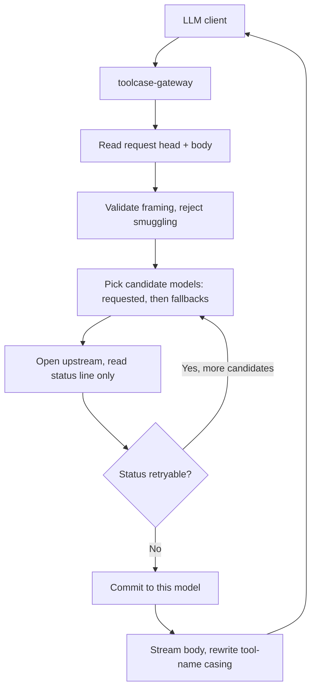

# toolcase-gateway

**A zero-dependency Rust reverse proxy that fixes LLM tool-name casing and fails over between models.**

`toolcase-gateway` sits between an LLM client (editor agent, CLI, SDK) and an
OpenAI-compatible HTTP endpoint. It solves two everyday problems with hosted
model routers:

1. **Tool-name casing drift** — upstreams frequently lowercase function/tool
   names (`MyTool` → `mytool`), which breaks strict clients that match names
   exactly. The gateway restores the original casing from the request.
2. **Model failure** — when a model returns `429`, `503`, or a payment/auth
   error, the gateway retries the same request against configured fallback
   models before returning anything to the client.

No crates. No async runtime. Small std-only Rust codebase split by responsibility.

---

## Table of contents

- [Why](#why)
- [How it works](#how-it-works)
- [Install](#install)
- [Quick start](#quick-start)
- [Configuration](#configuration)
- [Security model](#security-model)
- [Docs](#docs)
- [Development](#development)
- [License](#license)

## Why

| Problem | Without gateway | With gateway |
| --- | --- | --- |
| Upstream lowercases tool names | Client rejects unknown tool `mytool` | Casing restored to `MyTool` |
| Model returns `429`/`503` | Request fails, client shows an error | Transparent retry on fallback model |
| Streaming responses | Rewriting mid-stream corrupts partial JSON | Line-boundary buffering keeps pairs intact |
| Upstream sends gzip | Body cannot be rewritten | `Accept-Encoding: identity` forced upstream |

## How it works



The failover decision happens **before** any byte reaches the client, so a
retry is never visible downstream. Once the gateway commits to a model, the
body is streamed chunk-by-chunk with casing rewritten on the fly.

## Install

Requires Rust 1.74+.

```sh
git clone https://github.com/giauphan/toolcase-gateway.git
cd toolcase-gateway
cargo build --release
```

The binary lands at `target/release/toolcase-gateway` (~350 KB, stripped, LTO).

## Quick start

```sh
# Proxy 127.0.0.1:20129 -> 127.0.0.1:20128, falling back to "fail-try"
./target/release/toolcase-gateway
```

```sh
# Custom upstream and fallback chain
GW_TARGET_HOST=127.0.0.1 \
GW_TARGET_PORT=8080 \
GW_FALLBACK_MODELS="gpt-4o-mini,claude-3-5-sonnet" \
./target/release/toolcase-gateway
```

Point your client at `http://127.0.0.1:20129` instead of the upstream address.

## Configuration

All configuration is environment variables, read once at startup.

| Variable | Default | Description |
| --- | --- | --- |
| `GW_LISTEN_HOST` | `127.0.0.1` | Bind address. Non-loopback values log a warning. |
| `GW_LISTEN_PORT` | `20129` | Listen port. |
| `GW_TARGET_HOST` | `127.0.0.1` | Upstream host. |
| `GW_TARGET_PORT` | `20128` | Upstream port. |
| `GW_FALLBACK_MODELS` | `fail-try` | Comma-separated fallback models, tried in round-robin order. |
| `GW_MAX_CONNECTIONS` | `256` | Concurrent connection cap; excess gets `503`. |
| `GW_IO_TIMEOUT_SECS` | `120` | Read/write timeout per socket. `0` disables. |

Retryable upstream statuses: `402`, `403`, `408`, `429`, `500`, `502`, `503`,
`504`, `524`. `413` is deliberately excluded — a too-large request will fail
identically on every model.

## Security model

**The gateway performs no authentication.** It is designed to run on loopback
next to the client it serves. Binding it to a public interface exposes an open
proxy to your upstream credentials; put an authenticating front end in front of
it if you need remote access.

Hardening that is implemented:

- `#![forbid(unsafe_code)]` and zero third-party dependencies — no supply chain.
- **Request smuggling rejected**: conflicting or duplicated `Content-Length` /
  `Transfer-Encoding` framing returns `400`-class failure instead of being
  normalized.
- **Header injection rejected**: header names must be valid HTTP tokens; values
  containing `CR`, `LF`, or `NUL` are refused.
- **Request line validated**: method must be a token, target must be printable
  ASCII and ≤ 8192 bytes.
- **Bounded memory**: 64 KB head limit, 64 MB body limit, 1 MB rewrite window,
  so a newline-free stream cannot grow unbounded.
- **Bounded concurrency and time**: connection cap plus per-socket read/write
  timeouts prevent slowloris-style thread exhaustion.
- **Hop-by-hop headers stripped** in both directions.
- **Error bodies JSON-escaped** so upstream text cannot break out of the
  response envelope.

See [`SECURITY.md`](SECURITY.md) for reporting and [`docs/SECURITY_MODEL.md`](docs/SECURITY_MODEL.md)
for threat details.

## Docs

- [`docs/SYSTEM_DESIGN.md`](docs/SYSTEM_DESIGN.md) — maintenance map, runtime flow, invariants, debugging
- [`docs/ARCHITECTURE.md`](docs/ARCHITECTURE.md) — request lifecycle, module map, design tradeoffs
- [`docs/CONFIGURATION.md`](docs/CONFIGURATION.md) — every variable, tuning guidance, deployment recipes
- [`docs/SECURITY_MODEL.md`](docs/SECURITY_MODEL.md) — trust boundaries, threats, mitigations
- [`CONTRIBUTING.md`](CONTRIBUTING.md) — build, test, and PR workflow

## Development

```sh
cargo test              # 11 unit + integration tests
cargo clippy --all-targets
cargo fmt --check
cargo build --release
```

## License

MIT — see [`LICENSE`](LICENSE).

---

<sub>Keywords: rust http proxy, llm gateway, openai compatible proxy, model
failover, tool calling, function calling, reverse proxy, zero dependency rust,
tool name casing, streaming json rewrite.</sub>
