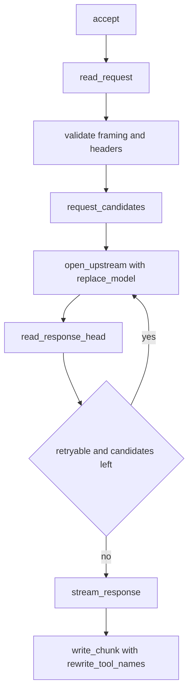

# Architecture

`toolcase-gateway` is a single-file, std-only HTTP/1.1 reverse proxy. One thread
per connection, no async runtime, no dependencies.

## Request lifecycle

### 1. Accept and admission control

`main` binds the listener and, for each connection, checks the `ACTIVE` counter
against `GW_MAX_CONNECTIONS`. Over the cap the socket receives a `503` and
closes immediately, so no thread is spawned. Accepted sockets get read and write
timeouts before the worker thread starts.

### 2. Read and validate the request

`read_request` reads until `\r\n\r\n` (capped at `MAX_HEAD_BYTES`, 64 KB), then
parses the request line and headers.

Validation is fail-closed:

- Method must be an HTTP token; target must be printable ASCII, at most 8192 bytes.
- `parse_headers` rejects names that are not tokens (catching `X-Bad : 1`, the
  classic smuggling variant) and values containing `CR`, `LF`, or `NUL`.
- Duplicate `Content-Length`, or `Content-Length` together with
  `Transfer-Encoding: chunked`, is rejected rather than resolved by preference.

Body reading is either length-delimited or `read_chunked_body`, both capped at
`MAX_REQUEST_BYTES` (64 MB).

### 3. Choose candidate models

`request_candidates` builds the attempt order:

1. The model named in the request body, if `"model"` is present.
2. Each configured fallback, starting at `rotation % fallbacks.len()`.

The rotation offset comes from a global `AtomicUsize`, so consecutive requests
that fail over do not all pile onto the same secondary model.

### 4. Attempt an upstream

`open_upstream` rewrites the `"model"` value via `replace_model`, then forwards
the request with these changes:

| Header | Action | Reason |
| --- | --- | --- |
| `Host` | replaced | must match the real upstream |
| `Content-Length` | recomputed | body length changed after model swap |
| `Accept-Encoding` | forced to `identity` | a compressed body cannot be rewritten |
| hop-by-hop | dropped | `Connection`, `TE`, `Upgrade`, etc. are per-hop |

Only the status line and headers are read (`read_response_head`). This is the
key design point: the failover decision is made before a single body byte is
sent to the client, so retries are invisible downstream.

### 5. Failover or commit

| Outcome | Candidates left | Action |
| --- | --- | --- |
| Status in `RETRYABLE` | yes | log, try next model |
| Status in `RETRYABLE` | no | stream it anyway |
| Any other status | n/a | commit and stream |
| Connect or IO error | yes | log, try next model |
| Connect or IO error | no | `502` with JSON error body |

`RETRYABLE` is `401, 402, 403, 408, 429, 500, 502, 503, 504, 524`. `413` is excluded
on purpose: an oversized request fails identically everywhere.

### 6. Stream and rewrite

`stream_response` always re-frames the response as `Transfer-Encoding: chunked`,
because the rewritten length is not known ahead of time. It strips
`Content-Length`, `Content-Encoding`, `ETag` (the body no longer matches the
upstream digest), and hop-by-hop headers.

The body is read either as upstream chunks (`read_one_chunk`) or by
`Content-Length`, accumulated into `output`, and flushed at the last newline.
That boundary matters: SSE and JSONL payloads put each record on its own line,
so a `"name":"..."` pair is never split across two `write_chunk` calls. If a body
contains no newline at all, `MAX_REWRITE_WINDOW` (1 MB) forces a flush so memory
stays bounded.

### 7. Rewrite tool-name casing

`rewrite_tool_names` collects every `"name":"Value"` from the request that
contains an uppercase letter, then scans the outgoing buffer for `"name"` keys
whose value case-insensitively matches, replacing it with the original casing. It
tolerates whitespace after the colon. Non-UTF-8 bodies pass through untouched.

## Module map

Everything lives in `src/main.rs`.

| Group | Functions |
| --- | --- |
| Startup | `main`, `env_or`, `Config` |
| Connection | `serve`, `write_error` |
| Request parsing | `read_request`, `parse_headers`, `read_until_headers`, `read_chunked_body`, `read_more` |
| Validation | `is_token`, `is_request_target`, `is_chunked` |
| Upstream | `open_upstream`, `read_response_head`, `request_candidates` |
| Response | `stream_response`, `write_chunk`, `read_one_chunk` |
| JSON | `replace_model`, `rewrite_tool_names`, `json_string_value`, `escape_json_string` |
| Helpers | `header_value` |

## Design tradeoffs

**Thread per connection, not async.** The workload is a handful of concurrent
long-lived streams from one local client. A thread per connection with a hard cap
is simpler, has no dependencies, and its worst case is bounded by
`GW_MAX_CONNECTIONS`.

**Hand-rolled JSON scanning, not a parser.** The gateway only needs two string
fields. Byte scanning avoids parsing multi-megabyte payloads and works on partial
streaming fragments, where a real parser would need the full document. The cost
is that pathological escaping could theoretically be missed, which is accepted
because a miss means "casing not fixed", never corruption.

**Always re-chunk the response.** Rewriting changes the body length, so
`Content-Length` cannot be preserved. Chunked framing is the only correct option.

**Single upstream host.** The gateway multiplexes across models, not hosts.
Multi-host routing belongs in a layer above.
