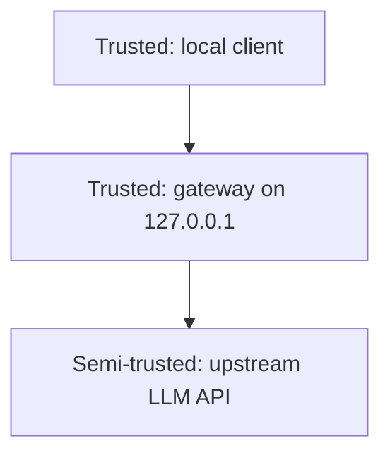

# Security Model

## Intended deployment

`toolcase-gateway` is a loopback sidecar. It is meant to run on the same host as
the client it serves, reachable only over `127.0.0.1`.



**The gateway performs no authentication and no authorization.** Any process that
can reach the listener can send requests through it, using whatever credentials
the client attaches or the upstream already holds. Binding to a non-loopback
address is therefore an open proxy; the process logs a warning when it detects
this, but does not refuse to start.

If remote access is required, terminate authentication in a front end (nginx,
Caddy, an authenticating proxy, or an SSH tunnel) and let it forward to the
gateway on loopback.

## Trust boundaries

| Boundary | Direction | Assumption |
| --- | --- | --- |
| Client to gateway | inbound | Client is local and authorized by OS-level access control. Its bytes are still parsed defensively. |
| Gateway to upstream | outbound | Upstream is reachable but not trusted to send well-formed HTTP. Its headers and body are validated and re-framed. |
| Upstream to client | passthrough | Upstream body content is rewritten but not otherwise sanitized; the client must still treat model output as untrusted. |

## Threats and mitigations

### Request smuggling

Conflicting framing lets an attacker desynchronize a proxy chain.

Mitigation: `read_request` rejects duplicate `Content-Length` headers, and rejects
`Content-Length` together with `Transfer-Encoding: chunked`, instead of picking a
winner. `parse_headers` rejects names that are not HTTP tokens, which catches the
`X-Bad : 1` and `Transfer-Encoding : chunked` obfuscations that some parsers
accept.

### Header injection and response splitting

A `CR` or `LF` smuggled through a header value can inject a second response.

Mitigation: header values containing `CR`, `LF`, or `NUL` are rejected on both
the request and the response path. The request target must be printable ASCII
excluding `"` and `\`. Upstream reason phrases are stripped of control
characters.

### Memory exhaustion

Mitigation: heads are capped at 64 KB, request bodies at 64 MB. The response
rewrite buffer flushes at the last newline, or at 1 MB if the body contains no
newline at all, so a single unbroken stream cannot grow without bound.

### Thread and descriptor exhaustion (slowloris)

Mitigation: `GW_MAX_CONNECTIONS` (default 256) caps concurrent connections, and
the check happens before `thread::spawn`, so excess load costs one `503` write
rather than a thread. Every socket carries a read and write timeout
(`GW_IO_TIMEOUT_SECS`, default 120s), so a stalled peer is reclaimed.

### Credential and header leakage

Mitigation: hop-by-hop headers (`Connection`, `Keep-Alive`, `Proxy-Authenticate`,
`Proxy-Authorization`, `TE`, `Trailer`, `Transfer-Encoding`, `Upgrade`) are
stripped in both directions. `Host` is rewritten to the real upstream. Bodies and
headers are never logged, so bearer tokens and prompts stay out of stderr.

### Response corruption from rewriting

Mitigation: the rewrite only fires on `"name"` keys whose value matches, case
insensitively, a `"name"` value from the request that contained an uppercase
letter. Non-UTF-8 bodies pass through byte-for-byte. Flushing at newline
boundaries prevents a key/value pair from being split across chunks, which would
otherwise let a partial match escape rewriting. A missed rewrite degrades to
"casing not fixed", never to a corrupted body.

Because rewriting changes body length, `Content-Length` and `ETag` are dropped
and the response is re-framed as chunked. Clients must not rely on the upstream
digest matching.

### Compressed bodies

A gzip or brotli body cannot be rewritten without decompressing it, which would
mean pulling in a dependency and buffering.

Mitigation: `Accept-Encoding: identity` is forced upstream and any client
`Accept-Encoding` is dropped. `Content-Encoding` is stripped from the response so
a non-compliant upstream cannot mislabel a plaintext body.

### Supply chain

Mitigation: zero third-party dependencies. `Cargo.lock` contains only this
package. `#![forbid(unsafe_code)]` is enforced at both the crate level and in
`Cargo.toml` lints, so no `unsafe` block can be introduced.

## Non-goals

- TLS termination. Run the gateway on loopback and let the upstream client handle
  TLS to the remote API.
- Authentication, rate limiting, or per-tenant quotas.
- Prompt or output filtering. The gateway does not inspect semantic content.
- Multi-host routing or load balancing across upstream endpoints.

## Verification

```sh
cargo test                    # framing, header, and rewrite tests
cargo clippy --all-targets
grep -rn "unsafe" src/        # only the forbid attribute
```

Tests covering the hardening above: `rejects_conflicting_framing_headers`,
`rejects_header_injection_in_names`, `rejects_malformed_request_targets`,
`error_body_escapes_message`, `forces_identity_encoding_upstream`.

## Reporting

See [`../SECURITY.md`](../SECURITY.md).
