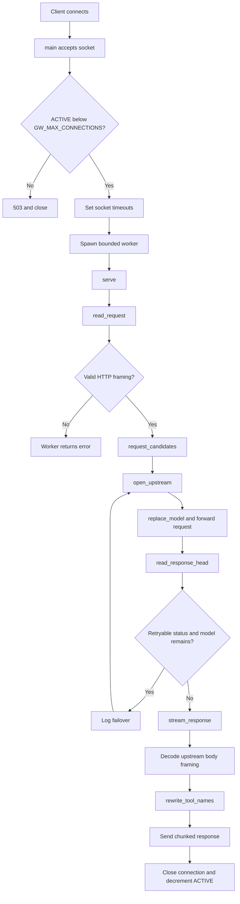

# System Design

This document describes current `toolcase-gateway` behavior and code ownership.
Use it as first map before changing code.

## Product boundary

`toolcase-gateway` is a local, zero-dependency Rust HTTP/1.1 proxy for
OpenAI-compatible LLM APIs.

It does two jobs:

1. Try requested and fallback model names before returning a retryable upstream
   failure.
2. Restore original tool/function name casing in streamed upstream responses.

It is not an authentication proxy, TLS terminator, JSON validator, account
manager, or multi-host load balancer.

## Runtime flow



## Components and ownership

All runtime code currently lives in `src/main.rs`.

| Area | Current symbols | Change here when... |
| --- | --- | --- |
| Startup/config | `main`, `env_or`, `Config` | Adding environment variables, startup limits, bind behavior |
| Admission control | `ACTIVE`, `RR_COUNTER`, connection loop | Changing concurrency or request scheduling |
| Request parsing | `read_request`, `parse_headers`, `read_until_headers`, `read_chunked_body`, `read_more` | Changing accepted HTTP syntax or body limits |
| Security validation | `is_token`, `is_request_target`, `is_chunked` | Changing header/framing defenses |
| Candidate selection | `request_candidates`, `json_string_value` | Changing model order, fallback rotation, or model lookup |
| Upstream forwarding | `open_upstream`, `replace_model`, `header_value` | Changing forwarded headers, target, or request body mutation |
| Response parsing | `ResponseHead`, `read_response_head`, `read_one_chunk` | Changing upstream response framing |
| Streaming/output | `stream_response`, `write_chunk`, `rewrite_tool_names` | Changing streaming, response headers, or tool-name repair |
| Error output | `write_error`, `escape_json_string` | Changing client-visible failures |
| Tests | `#[cfg(test)] mod tests` | Every behavior or security change needs coverage here |

Keep changes in the existing area. Do not add abstraction layers until one
area has multiple concrete implementations.

## Data flow

### Request

```text
TcpStream
  -> raw HTTP head + initial bytes
  -> Request { method, path, headers, body }
  -> candidate model list
  -> rewritten request body per candidate
  -> upstream TcpStream
```

`Request.body` is fully buffered because model selection and model replacement
must happen before connecting each attempt. Maximum request size is
`MAX_REQUEST_BYTES` (64 MiB).

### Response

```text
upstream status + headers
  -> failover decision before body reaches client
  -> upstream body framing decoded
  -> bounded rewrite buffer
  -> tool-name casing repair
  -> HTTP chunked response to client
```

The response is always re-framed as chunked after commitment. Do not restore
`Content-Length`: tool-name replacement can change byte length. `Content-Encoding`
and `ETag` are removed because the body is no longer the original encoded or
hashed representation.

## State and concurrency

- One worker thread handles one client connection.
- `ACTIVE` is an atomic count of active workers.
- `RR_COUNTER` is an atomic request rotation counter.
- `Config` is immutable after startup and shared through `Arc`.
- There is no global request cache, persistent state, database, or shutdown
  controller.
- Connections close after one request. Keep-alive is not supported.

The effective resource bound is approximately:

```text
GW_MAX_CONNECTIONS * (MAX_REQUEST_BYTES + MAX_REWRITE_WINDOW)
```

Actual usage is usually lower, but deployment limits should account for this
worst case plus thread and socket memory.

## Failover contract

Candidate order:

1. `"model"` value in request JSON, when found.
2. `GW_FALLBACK_MODELS`, comma-separated, rotated by request number.
3. Empty model only when neither request nor fallback supplies a candidate.

A candidate is retried when:

- TCP connect or upstream I/O fails; or
- upstream status is one of `402, 403, 408, 429, 500, 502, 503, 504, 524`.

A `413` is not retryable. It normally means request size/content is invalid for
all models and retrying would waste capacity.

The first non-retryable response is committed and streamed. If the last
candidate returns a retryable response, that response is still streamed; the
proxy does not loop forever.

## Security invariants

Preserve these invariants when editing code:

1. Listener defaults to loopback (`127.0.0.1`).
2. `#![forbid(unsafe_code)]` remains enabled.
3. Request head stays bounded by `MAX_HEAD_BYTES`.
4. Request body stays bounded by `MAX_REQUEST_BYTES`.
5. Duplicate `Content-Length`, and `Content-Length` plus chunked transfer
   encoding, are rejected.
6. Header names are HTTP tokens; header values cannot contain `CR`, `LF`, or
   `NUL`.
7. Hop-by-hop headers do not cross either proxy boundary.
8. Upstream response body is not sent until failover decision completes.
9. Rewrite buffer remains bounded by `MAX_REWRITE_WINDOW`.
10. Error messages are JSON-escaped before client output.
11. Credentials, prompts, and response bodies are never logged.
12. Public binding is never treated as authenticated access.

Detailed threat analysis is in [`SECURITY_MODEL.md`](SECURITY_MODEL.md).

## Common maintenance tasks

### Add environment variable

1. Add field to `Config`.
2. Parse it once in `main` with a safe default.
3. Pass `Config` to the function that owns behavior.
4. Add it to `README.md` and `docs/CONFIGURATION.md`.
5. Add or update a focused test.

Do not call `env::var` inside request workers. Startup-only configuration keeps
request behavior deterministic and avoids per-request environment parsing.

### Change retry statuses

1. Edit `RETRYABLE`.
2. Add a test explaining why status is or is not retryable.
3. Update retry status lists in `README.md`,
   `docs/ARCHITECTURE.md`, and `docs/CONFIGURATION.md`.

Do not retry arbitrary `4xx` statuses. Many indicate invalid request data.

### Change request parsing

Start with tests for:

- normal `Content-Length` body;
- chunked body;
- duplicate/conflicting framing;
- malformed header name/value;
- oversized head/body;
- early EOF.

Keep parsing fail-closed. Never silently choose one interpretation when two
HTTP framing interpretations are possible.

### Change streaming rewrite

Preserve three rules:

- upstream compression is disabled with `Accept-Encoding: identity`;
- response is sent chunked after rewriting;
- partial `"name"` pairs are not flushed before rewrite can see them.

Test both newline-delimited output and a body split at a tool-name boundary.

### Add a new file/module

Current code is intentionally single-file. Split only when a boundary becomes
hard to review or test. A safe future split would be:

```text
src/
  main.rs       startup and worker lifecycle
  config.rs     Config and environment parsing
  http.rs       framing, headers, request/response types
  routing.rs    candidates and failover
  rewrite.rs    model/tool-name transformations
```

If splitting happens, keep functions private by default and expose only the
smallest interfaces needed by `main` and tests.

## Validation loop

Run focused checks first, then full checks:

```sh
cargo fmt --all -- --check
cargo test
cargo clippy --all-targets -- -D warnings
cargo build --release
```

Before pushing security-sensitive changes, inspect the diff and verify no
credentials or request bodies entered logs:

```sh
git diff --check
git diff -- src/main.rs
```

CI runs the same format, clippy, test, and release-build checks from
`.github/workflows/ci.yml`.

## Operational debugging

Startup log confirms listener and target:

```text
[toolcase-gateway] 127.0.0.1:20129 -> 127.0.0.1:20128
```

A request log lists the actual candidate order:

```text
[toolcase-gateway] request POST /v1/chat/completions candidates: primary, fallback-a, fallback-b
```

A failover log confirms status-driven retry:

```text
[toolcase-gateway] upstream model "primary" returned HTTP 503. Failing over to "fallback-a"...
```

If Zed reports an upstream `503` and there is no failover log, inspect:

1. Zed is calling `127.0.0.1:20129`, not the upstream directly.
2. The running process is the rebuilt binary.
3. `GW_FALLBACK_MODELS` contains real active model IDs, not `fail-try`.
4. `/tmp/toolcase-gateway.log` or service stderr contains the candidate list.

`ALL_ACCOUNTS_INACTIVE` is an upstream account/provider state, not a gateway
retry decision. The gateway can try another model, but it cannot activate an
upstream account.

## Known constraints

- No authentication.
- No TLS termination.
- No graceful shutdown signal handling.
- One request per connection.
- Hand-rolled JSON string scanning is intentionally limited; it is not a general
  JSON parser.
- Fallbacks change model names only; they do not switch upstream hosts or
  provider accounts.

These constraints are deliberate. Document any change that alters them because
it affects deployment and threat assumptions.
