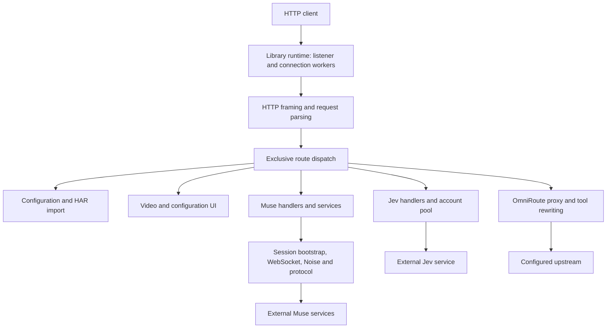
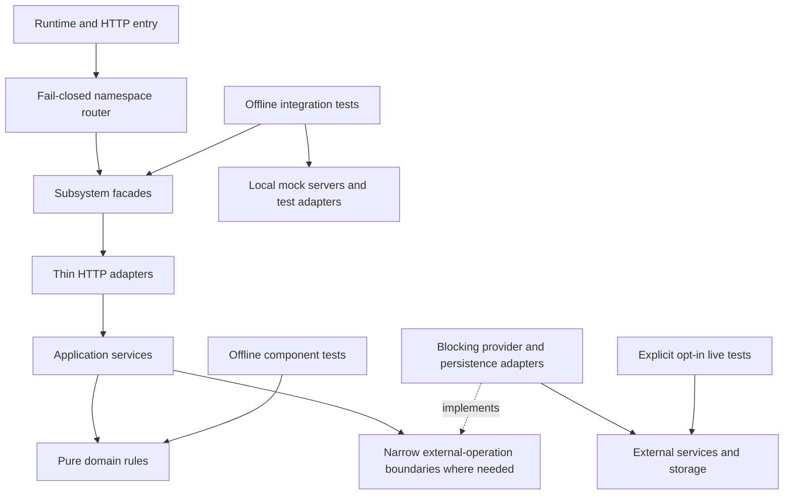

# System design review: modular gateway and tests

Status: proposed, awaiting owner approval. No runtime or test migration performed.

## Evidence from the current working tree

The project is already a modular synchronous Rust gateway, not a single-file or dependency-free application. `Cargo.toml` includes HTTP, WebSocket, Noise, serialization, UUID, and environment dependencies. `src/lib.rs` owns startup and connection workers; `src/main.rs` is a thin executable entry point.



This is a component map, not proof of runtime correctness. Source evidence: `src/lib.rs`, `src/routes.rs`, `src/museai/mod.rs`, and the corresponding modules. Live services have not been exercised.

### Findings

| Finding | Evidence | Design implication |
| --- | --- | --- |
| Test migration has already started | Four integration targets in `tests/`; legacy `src/tests.rs` deleted in the working tree | Preserve the existing work rather than start over |
| Some test files still combine large responsibilities | `core_http_tests.rs` 701 lines; `protocol_omniroute_tests.rs` 617; `har_config_tests.rs` 754; `museai_live_tests.rs` 522 | Split by behavior, not arbitrary line ranges |
| Tests depend on implementation details | `tests/gateway/museai_live_tests.rs` imports Muse Noise, protocol, session, transport, and stream internals | Review the API boundary; moving files alone is not architectural separation |
| Production library exports test support | `src/lib.rs` declares public `test_helpers`; helper code writes live-session state | Keep test-only support outside production runtime/API |
| Live and offline tests share a module | `museai_live_tests.rs` includes route tests, parser tests, and external service tests | Make external execution explicitly opt-in and independently visible |
| Live checks have inconsistent gates | Some require explicit live flags; one loads dotenv and runs when a cookie exists | Default test execution should not create external resources because credentials happen to exist |
| Documentation disagrees with source | `docs/SYSTEM_DESIGN.md`, `docs/ARCHITECTURE.md`, `.claude/claude.md`, `CONTRIBUTING.md` retain obsolete paths or dependency claims | Reconcile architecture documentation during approved migration |
| Remaining production hotspots | `src/har_config.rs` 797 lines; `src/museai/chat.rs` 588 | Review cohesive decomposition without unrelated rewrites |

Line counts describe this inspection only. No current Rust source or test file exceeded 800 lines in the inventory.

## Proposed design for approval

Retain a **modular monolith with layered responsibilities**. Keep the synchronous request pipeline, exclusive provider routing, and subsystem facades. Do not introduce microservices, an async runtime, a generic provider framework, or a dependency-injection framework merely to organize tests.

Within each provider, separate:

- **HTTP adapters:** validate/translate requests and write responses.
- **Application services:** coordinate chat, video, sessions, and cleanup use cases.
- **Domain rules:** validation and decisions that can be tested without sockets or credentials.
- **Infrastructure adapters:** remote HTTP, WebSocket, Noise framing, persistence, and provider-specific I/O.

These are proposed responsibility boundaries, not a claim that the existing code already enforces them. Introduce narrow replaceable boundaries only where a concrete offline test requires them. Domain rules should not depend on HTTP serialization or sockets.



The dashed arrow denotes implementation of a boundary, not runtime data flow. Existing externally used entry points remain compatible; reducing currently public internals requires an explicit compatibility review rather than silently making them private.

## Proposed test organization

All test bodies, fixtures, and test-only helpers belong under `tests/`, as requested. Keep small Cargo integration-target entry files; they declare focused nested modules and contain no growing all-in-one suite.

Suggested ownership groups, not mandatory renames:

| Target/group | Focused modules |
| --- | --- |
| Gateway | HTTP request validation, response framing, route isolation, retry/fallback, model normalization, tool rewriting |
| Configuration | HAR extraction, sanitization, validation, persistence, HTTP configuration routes |
| Muse | Domain rules, chat stream parsing, protocol/Noise, video extraction, session lifecycle, thread cleanup |
| Jev | Route behavior, account selection/rotation, provider failure handling |
| UI | Template and configuration-page behavior |
| Live | Explicitly enabled external authentication, owned session checks, chat/video and cleanup checks |
| Shared support | Local mock servers, sanitized fixtures, temporary resources, test-only builders |

Use nested support directories rather than accidentally creating extra top-level Cargo test targets. Aim below 450 lines per module; do not exceed 800 lines. Avoid wildcard imports and blanket unused-import allowances as the permanent organization mechanism.

### Rust visibility decision

Rust integration tests compile as separate crates: they cannot access `pub(crate)` or private internals. Keeping files in `tests/` must not force every internal module into the public API.

Recommended policy for approval:

1. Prefer integration tests through intentionally supported library/subsystem boundaries.
2. When a private algorithm genuinely needs direct tests, allow test-only modules compiled inside the library whose source files live under `tests/`. They are unit/component tests by compilation model, despite their physical location.
3. Keep those private-test files in nested directories so Cargo does not auto-discover them as independent integration targets.
4. Do not duplicate production source into integration targets or expose private credential/transport state merely for test access.

This satisfies the requested filesystem layout while preserving the option of crate-private facades. If the owner requires every test to be a separate integration crate, the tradeoff is testing only supported public behavior or deliberately expanding the public API.

### Test execution contract

- Default test execution is offline with respect to external services; loopback mock servers are allowed.
- Live suites are explicitly opt-in, clearly report skipped/not-run status, and never use credential presence alone as consent.
- Live resource creation must document cleanup and possible provider costs.
- No raw captures, cookies, signed URLs, tokens, or live-session artifacts enter committed fixtures.
- Compare test discovery before/after and map every relocated test to its new owner. A green suite with missing tests is not acceptance.

## Migration approval gates

Approve the responsibility boundaries, all-tests-under-`tests/` policy, private-test compilation exception, and offline/live separation first. Then migrate incrementally, preserving the current working tree and observable routes. Reconcile stale architecture documentation as part of that approved work.

Required implementation validation:

```sh
cargo test -- --list
cargo fmt
cargo clippy --all-targets
cargo test
cargo build --release
```

Before executing the current tests, inspect their live gates; the current suite can use externally configured credentials. This design review has not run the test suite, built the project, or verified provider behavior.

## Miro review

The requested publication channel is Miro MCP through Claude CLI only. The CLI reported Miro tool availability. A drawing request for a new board titled `Toolcase Gateway - Architecture and Test Migration Review` timed out after 180 seconds without returning a result. A subsequent read-only lookup failed with `Exceeded USD budget (1)`. Board creation and diagram contents are therefore unknown, not verified; no board URL was returned. Check for a partially created board before retrying creation. Only sanitized architecture descriptions were supplied in the drawing prompt. This document is the available local review artifact; publication remains blocked pending a successful MCP check.

## References

- Existing source and test files named above are the primary evidence.
- Rust test organization: https://doc.rust-lang.org/book/ch11-03-test-organization.html
- Cargo target discovery: https://doc.rust-lang.org/cargo/reference/cargo-targets.html
- Existing architecture intent: `.claude/claude.md`.
- Requirements and constraints: `plan/pending/system-design-and-test-migration-review.md`.
